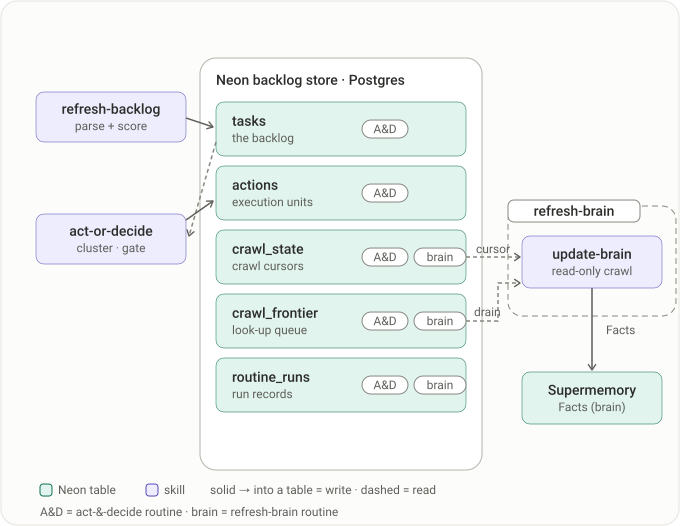

# jupi-skills

The source of truth for the **Agent Skills that talk to Jupi** — the team's decision platform. Install once; updates flow automatically.

These skills let an agent (in Claude Code, Cowork, or Cursor) work with your team's decisions through the **Jupi MCP**:

| Skill | What it does |
|---|---|
| **search-decisions** | Surface prior decisions related to what you're working on — precedents and contradictions. Read-only. |
| **log-decision** | Record a decision you've **already made** as a finalized, searchable entry (title + chosen path + rationale). |
| **submit-decision** | Open a decision you **can't settle alone** and assign it to the right decider. Creates but never finalizes. |

All three are bundled in a single plugin, `jupi-skills`.

This marketplace also ships **`proactive-jupi`** — the proactive decision engine that builds context on you and your work, turns incoming signals into a scored task backlog, and posts ready-to-settle Jupi decisions for genuine trade-offs — and **`playbook-jupi`**, its closed-world sibling that runs a user-declared process instead of discovering work. See [Proactive-Jupi](#proactive-jupi) and [Playbook-Jupi](#playbook-jupi) below.

> The skills call the **Jupi MCP server** (`https://apis.jupi.co/mcp`). In Claude Code & Cowork it's **bundled with the plugin** — nothing to install separately. Cursor needs it added manually (see [Cursor](#cursor)).

---

## Install

### Claude Code & Cowork (plugin marketplace)

```
/plugin marketplace add jupi-co/jupi-skills
/plugin install jupi-skills@jupi-skills
```

CLI equivalent (handy for scripting / Cowork setup):

```bash
claude plugin marketplace add jupi-co/jupi-skills
claude plugin install jupi-skills@jupi-skills
```

Invoke a skill (namespaced by plugin):

```
/jupi-skills:search-decisions
/jupi-skills:log-decision
/jupi-skills:submit-decision
```

The plugin **bundles the Jupi MCP**, so it's registered automatically when the plugin installs — no separate MCP setup, no `.mcp.json`, no claude.ai connector. On first use, approve the one-time authentication prompt.

They also auto-trigger from natural phrasing — e.g. "have we decided X?" (search), "log that we're going with Y" (log), "escalate this to the eng lead" (submit).

> **Versioning:** none, by design. Consumers track `main` (the default branch); the effective version is its latest commit SHA. Every commit that lands on `main` is one clean update for everyone — no version bumps, no release bookkeeping. So keep `main` shippable.

### Auto-update

Enable **per-marketplace auto-update** for `jupi-skills` in the `/plugin` interface. Because this repo is public, no token is needed — Claude Code pulls the latest at session start and reinstalls changed plugins. Without auto-update, refresh manually:

```
/plugin marketplace update jupi-skills
```

### Cursor

Cursor doesn't read `marketplace.json` or load Claude Code plugins, so it can't use the marketplace above. Install the same skills straight from this repo with the open [`skills` CLI](https://github.com/vercel-labs/skills) (one installer, works across Cursor and ~80 other agents):

```bash
# from your project root — installs all three into .agents/skills/ (which Cursor reads)
npx -y skills add jupi-co/jupi-skills --skill '*' -a cursor

# pull the latest from this repo anytime
npx -y skills update
```

- **Scope:** project by default (lands in the repo, shareable with the team); add `-g` to install globally for all your projects. Add `--copy` to vendor independent copies instead of symlinking to a canonical store.
- After install, reload the window (Cmd/Ctrl+Shift+P → "Developer: Reload Window") if Cursor doesn't pick the skills up immediately.

No-CLI alternatives:

- **Settings UI (auto-synced):** Cursor → Settings → Rules → Add Rule → **Remote Rule (GitHub)** → paste `https://github.com/jupi-co/jupi-skills`. Per-user; stays synced with this repo.
- **Manual copy:** copy a skill folder into `.cursor/skills/<skill>/` (or `.claude/skills/<skill>/`, which Cursor also reads), then reload.

**Cursor also needs the MCP.** Plugins don't reach Cursor, so the bundled server doesn't apply here — add the Jupi MCP once to `.cursor/mcp.json` (or global `~/.cursor/mcp.json`), then reload the window. Without it the skills load but their Jupi calls have nothing to reach.

```json
{
  "mcpServers": {
    "Jupi": { "url": "https://apis.jupi.co/mcp" }
  }
}
```

### Optional: pre-wire install for a consuming repo

A repo that wants these skills available to everyone who clones it can add to its `.claude/settings.json`:

```json
{
  "extraKnownMarketplaces": {
    "jupi-skills": {
      "source": { "source": "github", "repo": "jupi-co/jupi-skills", "ref": "main" }
    }
  },
  "enabledPlugins": {
    "jupi-skills@jupi-skills": true
  }
}
```

This is opt-in by the consuming repo, not something this marketplace controls.

---

## Configuration: point the skills at your workspace

Once installed, the skills need to know which Jupi **workspace** to act on. Put the slug in `.claude/jupi.local.json` at the root of the project you're working in (gitignored — never commit it):

```json
{
  "workspace": "<your-group-slug>",
  "contacts": {
    "Eng Lead": "22222222-2222-4222-8222-222222222222"
  }
}
```

- `workspace` — required; used as `groupSlug` on every Jupi call.
- `contacts` — optional name→Jupi-user-UUID map used by **submit-decision** to assign a decider without re-typing UUIDs.
- `telemetry` — optional, **on by default** during the current testing phase. See below.

If the file is missing, the skills just ask for the slug and offer to save it — so this is optional convenience, not a blocker.

A user-level `~/.claude/jupi.local.json` is merged with the project file, project winning — so you can set something once and override it per repo.

### Usage telemetry

> **On by default during the current testing phase.** The first time it reports, you'll see a one-time notice in the terminal. To turn it off, add `"telemetry": false` to the config above.

The plugin reports the shape of each turn to Jupi, so we can see when the decision skills fire — and, more usefully, when one should have fired and didn't.

**What is sent, per turn:** a random trace id, a hashed conversation id, the plugin version, which surface you're on, timestamps, whether the prompt looked like ideation work, which of the three decision skills fired, and **the first 2000 characters of your prompt**.

**What is never sent:** file paths, file contents, tool arguments, tool results, Claude's replies, or the rest of the conversation.

That prompt text is the part worth knowing about. It is broader than what Jupi already receives — the skills record decisions you *chose* to log, whereas this captures the opening of every turn while the plugin is loaded, including turns that have nothing to do with decisions.

**To turn it off:** set `"telemetry": false` in `.claude/jupi.local.json` (or the user-level `~/.claude/jupi.local.json`). `JUPI_SKILLS_TELEMETRY=off` overrides for a single session.

#### Sandboxed environments (remote Cowork)

Telemetry POSTs directly to `apis.jupi.co` from a hook subprocess. In a sandboxed environment with an egress proxy — notably **remote Cowork** — that host must be on the egress allowlist, or every send fails silently and those sessions are invisible to telemetry. (The decision skills themselves still work: the MCP server is brokered through the host, not the container's proxy, so it is unaffected.)

To fix, add the telemetry host to the sandbox's egress allowlist:

```
apis.jupi.co
```

Note the plural — `apis`, not `api` (the singular doesn't resolve). Use whatever form the allowlist expects (bare host, `https://apis.jupi.co:443`, or `*.jupi.co`). Verify from *inside* the sandbox afterward by confirming a turn reaches Jupi — a raw connection test can bypass the proxy and give a false pass.

---

## Proactive-Jupi

`proactive-jupi` is the proactive decision engine. Where the three decision skills above are things **you** invoke, proactive-jupi runs a loop over your connected tools (Gmail, Calendar, Linear…): it maintains a per-user brain of context, turns incoming signals into a scored task backlog, and — only for genuine trade-offs — posts ready-to-settle Jupi decisions whose options each carry an executable action, then executes the ones you resolve.

### Architecture

Two scheduled routines (daily, cloud). **refresh-brain** crawls your tools into the Supermemory brain; **act-&-decide** works the backlog: parse + score signals into Neon, then either act (draft/send) or raise a decision in Jupi for you to finalize. Boxes say what each skill does; arrows carry the entity that flows.

<p align="center"></p>

State lives in three stores — **Neon** (tasks + actions), **Jupi** (decisions + lifecycle), **Supermemory** (Facts). Neon holds five tables; here is who reads and writes each, and how the refresh-brain routine uses `crawl_state` (its cursor) and `crawl_frontier` (drained into Facts).

<p align="center"></p>

### Install and set up

Install it from the same marketplace:

```
/plugin install proactive-jupi@jupi-skills
```

It bundles the same Jupi MCP and **depends on `jupi-skills`** (declared in its manifest), so installing it pulls the decision skills too. It also needs a Neon database and a Supermemory brain — the bundled **setup skill** cold-starts the workspace end to end:

```
/proactive-jupi:setup-proactive-jupi
```

Setup front-loads everything human-gated into an attended prelude — config keys, OAuth consents, questions about your stack and tools, and the Neon credential + egress probe — behind a `✋ needs-you done` boundary. Steps after that boundary run unattended. Budget ~15 minutes and stay at the keyboard until you see it.

> **Allowlist Neon's hosts first.** Proactive-Jupi reaches Neon over HTTPS, and databases live on per-project `*.aws.neon.tech` hosts. If your environment restricts network egress, allow **`*.aws.neon.tech`** (and **`*.neon.tech`**) under **Admin settings → Capabilities → network access** before running setup, so the egress probe clears on the first try. (This is separate from the telemetry host above — allow both.)

Its skills: `refresh-backlog` (signals → scored tasks), `update-brain` (crawl tools into Facts), `act-or-decide` (work the backlog: act or raise a decision), `act-post-decision` (carry out decisions you've settled), `execute-action` (the only skill that writes to your tools), and `setup-proactive-jupi`. Instance state and secrets live under `.proactive-jupi/` (gitignored).

### Config — the engine's own two files

Separate from the decision skills' [`.claude/jupi.local.json`](#configuration-point-the-skills-at-your-workspace) above; the engine reads its own. Both are gitignored and each has a committed template. **Neither ever names a tool** — which tool plays which role lives in `.proactive-jupi/assets.md` (the roles table: `inbox`, `context`, `work`, `decision`, `rules`, `brain`).

| File | Holds | Template | Who reads it |
|---|---|---|---|
| `.proactive-jupi/config.local.json` | Per-workspace **ids/secrets** to reach a store (`jupiUserId`, `neonConnString`, `rulesStoreRef`, …) + **settings/thresholds** (`crawlWindowDays`, `ruleThreshold`, `guardrails`, …) | [`…/reference/config.template.json`](plugins/proactive-jupi/skills/setup-proactive-jupi/reference/config.template.json) — setup copies it in and collects missing keys | The skills, at runtime |
| `.proactive-jupi/.env` | **Dev-tooling secrets for this repo only** (`SUPERMEMORY_API_KEY`) | [`.proactive-jupi/.env.template`](.proactive-jupi/.env.template) — `cp .proactive-jupi/.env.template .proactive-jupi/.env` | Repo scripts you run by hand (`evals/*/purge-scratch.sh`, ad-hoc HTTP-API ops) |

The Supermemory key is deliberately **not** in `config.local.json`: that file is mirrored into unattended/cloud run CWDs, so an admin-scoped key would travel with every scheduled routine. The runtime never needs it — the skills reach Supermemory through the installed MCP connector.

Design docs for the engine (the implementation plan and the per-phase plans referenced from its skills and evals) live in [`docs/proactive-jupi/`](docs/proactive-jupi/).

---

## Playbook-Jupi

`playbook-jupi` is the **closed-world** sibling of proactive-jupi, forked from it. Where proactive *discovers* work in your tools, playbook-jupi **runs a process you declare**: your playbook defines the frame — what is in scope, which long-lived dossiers are tracked, and the lifecycle they traverse. Holes in the playbook surface as ready-to-settle Jupi decisions; validated decisions become rules that graduate steps from ask-every-time to act (draft-gated). The engine is deliberately domain-agnostic — the playbook's content (an outreach funnel, a hiring pipeline, contract reviews…) is yours; the model and its guarantees live in [`playbook-contract.md`](plugins/playbook-jupi/shared/playbook-contract.md).

### Install (Claude Code & Cowork — desktop app included)

Open a session **in the workspace where your playbook config lives** — the skills resolve `.playbook-jupi/config.local.json` walking up from the session's folder, so a session opened elsewhere won't see it. Then:

```
/plugin marketplace add jupi-co/jupi-skills
/plugin install playbook-jupi@jupi-skills
```

Skip the first line if the marketplace is already registered (then `/plugin marketplace update jupi-skills` refreshes it). Installing pulls the `jupi-skills` dependency and the bundled Jupi MCP automatically; the skills appear namespaced as `/playbook-jupi:…`.

### Configure

Instance state and secrets live under `.playbook-jupi/` at the workspace root (gitignored — never commit it):

```bash
cp dev/config.template.json .playbook-jupi/config.local.json
```

Fill the placeholders in the copy — the template's `_`-prefixed keys document what each value means. The config's **keys** are engine vocabulary (`watchedSource`, `dossierSource`, `inboundStage`, …); its **values** are your playbook's content.

### Status — what runs today

The engine is under active build; skills go live progressively, PR by PR. **The single source of truth for what runs today is the dev-bench runbook's status table: [`dev/DEV-ENV.md`](dev/DEV-ENV.md)** — this README deliberately doesn't duplicate it (a copy would drift). Until the bootstrap skill lands, that runbook — seed a declared world from a source file, sweep, inspect, reset, replay — *is* the setup path; `setup-playbook-jupi` is a guarded skeleton that says so if invoked.

---

## Repo layout

```
.claude-plugin/marketplace.json        the catalog
plugins/jupi-skills/
  .claude-plugin/plugin.json           plugin manifest (no version — by design)
  .mcp.json                            bundled Jupi MCP (auto-registers on install)
  hooks/                               ideation nudge + turn telemetry (hooks.json + 4 py)
  skills/
    search-decisions/SKILL.md
    log-decision/SKILL.md
    submit-decision/SKILL.md
plugins/proactive-jupi/
  .claude-plugin/plugin.json           manifest (no version; depends on jupi-skills)
  .mcp.json                            bundled Jupi MCP
  shared/                              db.mjs, schema.sql, apply-schema.mjs, ensure-deps.sh
  skills/                              refresh-backlog, update-brain, act-or-decide,
                                       act-post-decision, execute-action, setup-proactive-jupi
plugins/playbook-jupi/                 closed-world fork of proactive-jupi (see the Playbook-Jupi
                                       section; live-skill status: dev/DEV-ENV.md). shared/ db.mjs +
                                       ensure-deps.sh stay byte-identical with proactive-jupi —
                                       CI-enforced; execute-action, act-post-decision, update-brain
                                       are synced copies (marker in each SKILL.md); playbook.mjs +
                                       playbook-contract.md carry everything the fork adds
dev/                                   the playbook-jupi dev bench: DEV-ENV.md (runbook + status),
                                       seed/reset, config template, mirror/ fixture world
tools/                                 validate-plugin.sh, package-plugin.sh, install-hooks.sh, …
evals/                                 skill eval suites (run-eval.sh, seed-scratch.mjs)
docs/                                  architecture diagrams (SVG)
docs/proactive-jupi/                   engine design docs (IMPLEMENTATION-PLAN, PHASE-2…5-PLAN)
.proactive-jupi/.env.template          dev-tooling secrets template (copy to .env, gitignored)
CLAUDE.md                              working conventions for agent sessions in this repo
.githooks/post-commit                  validates + rebuilds dist/ zips on commit (opt-in via tools/install-hooks.sh)
.github/workflows/validate.yml         CI: validates catalog + every plugin on each PR/push
CONTRIBUTING.md                        how to add/edit a skill and ship it
```

## Versioning

Deliberately **none**. No `version` field anywhere → the version resolves to the latest commit SHA on `main`, so updates ship with zero release bookkeeping. See [CONTRIBUTING.md](CONTRIBUTING.md) for the workflow.

## License

[MIT](LICENSE).
